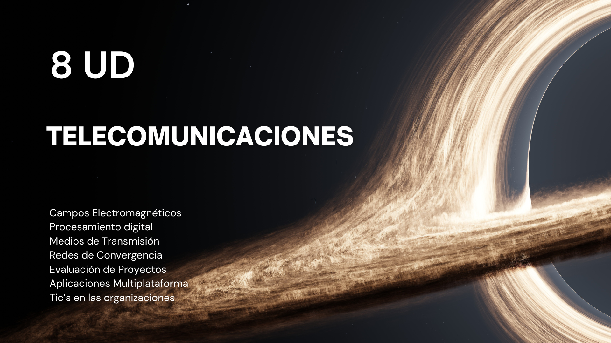

# Universidad - Evidencias Académicas

Este repositorio contiene las evidencias de aprendizaje y proyectos desarrollados en las materias de **Audio y Video** y ****.

## Contenido

### Procesamiento Digital de señales de Audio y Video
- **Laboratorios:** Archivos y reportes de prácticas realizadas.
- **Proyectos:** Implementaciones y simulaciones relacionadas con transmisión digital.
- **Apuntes:** Documentación y recursos teóricos.

### Redes de Convergencia
- **Desarrollo de Aplicaciones:** Código fuente y documentación de aplicaciones.
- **Proyectos Finales:** Entregables y presentaciones.
- **Recursos Adicionales:** Material complementario.

### Servicios Telematicos
- **Desarrollo de Aplicaciones:** Código fuente y documentación de aplicaciones.

### Desarrollo de aplicaciones multiplataforma
- **Desarrollo de Aplicaciones:** Código fuente y documentación de aplicaciones.


## Estructura del Repositorio
```
```

    
```


## Licencia
Este repositorio es para uso académico y no tiene fines comerciales.

---
**Autor:** Jaider Sebastian Moreno Quintero
**Contacto:** morenoquinterojaidersebastian@gmail.com